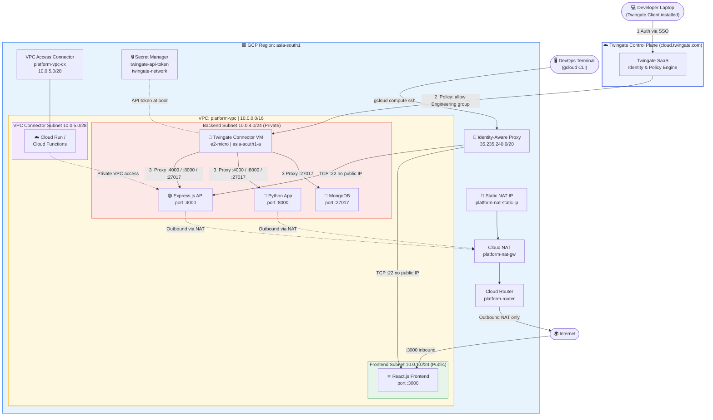
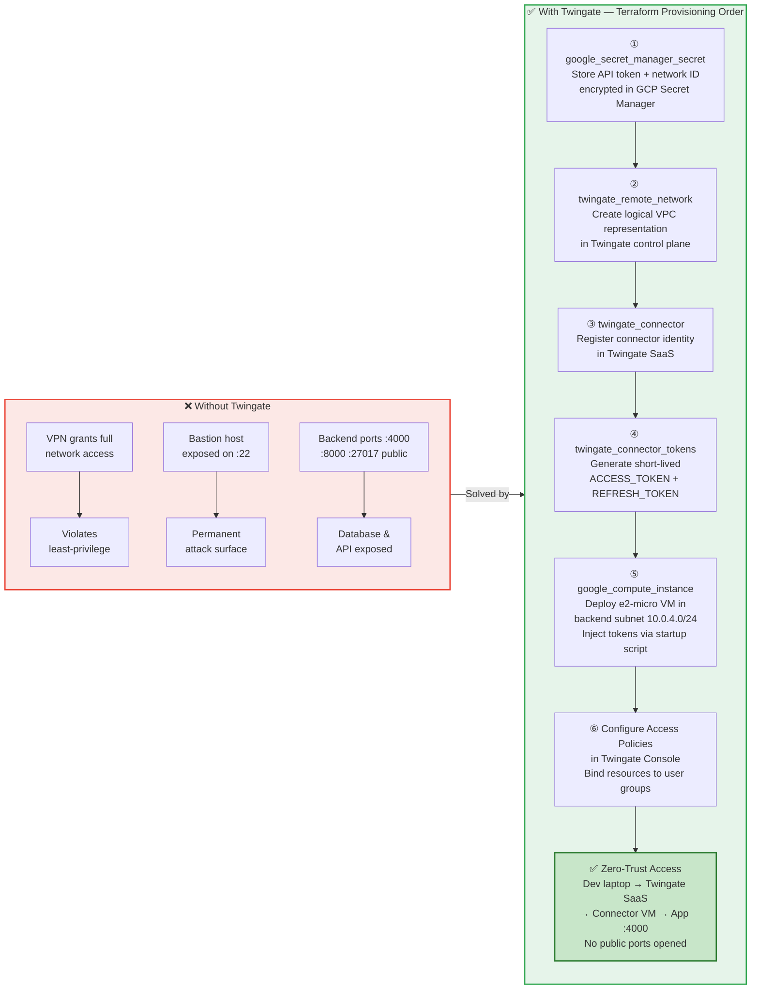

# Terraform GCP Custom VPC - Platform Infrastructure

  

---

**Robust infrastructure-as-code (IaC) written in Terraform** to provision a highly available, secure, and multi-tier Virtual Private Cloud (VPC) named **platform-vpc** in Google Cloud Platform (`asia-south1`).

It is designed following GCP best practices (Regional Subnets, Identity-Aware Proxy, Cloud NAT) to host a modern, full-stack microservices architecture (React.js frontend, Node/Express.js backend, Python applications, and MongoDB).

## Use Case

### 🎯 Problem Statement
Modern cloud applications require a **secure, scalable, and auditable** network foundation. Without a properly structured VPC, organisations risk:
- Exposing backend services (APIs, databases) directly to the public internet
- Using insecure SSH jump-boxes or VPN setups that are difficult to audit
- Overpaying for egress by lacking controlled outbound traffic routing
- Building bespoke, non-repeatable network configurations that break in CI/CD

This project solves all of the above by providing a **fully parameterised, production-ready GCP VPC** as Infrastructure-as-Code.

---

### 🏢 Primary Use Case — Multi-Tier Microservices Platform
This infrastructure is purpose-built for organisations deploying **full-stack microservices** on GCP compute (VMs, GKE, Cloud Run). A typical stack it supports:

| Tier | Workload | Subnet | Visibility |
| :--- | :--- | :--- | :--- |
| **Frontend** | React.js SPA / Load Balancer | `platform-vpc-frontend` (`10.0.1.0/24`) | Public (Internet-facing) |
| **Backend** | Node/Express.js REST API | `platform-vpc-backend` (`10.0.4.0/24`) | Private (VPC-internal only) |
| **Data** | Python workers / MongoDB | `platform-vpc-backend` (`10.0.4.0/24`) | Private (VPC-internal only) |
| **Serverless** | Cloud Run / Cloud Functions | `platform-vpc-connector-subnet` (`10.0.5.0/28`) | Private via VPC Connector |

**Result:** Frontend traffic enters from the internet on port `3000`, while backend APIs (`4000`), Python services (`8000`), and MongoDB (`27017`) are fully isolated inside the private subnet and only reachable from within the VPC CIDR `10.0.0.0/16`.

---

### 🔐 Use Case 2 — Zero-Trust SSH & Application Access via Twingate
Traditional approaches expose a bastion host (jump box) on `0.0.0.0/0:22`, creating a permanent attack surface. This project eliminates that entirely using a **dual zero-trust model**: IAP for SSH and Twingate for application-level access.

#### The Problem with Traditional Access
| Method | Risk |
| :--- | :--- |
| Public bastion host on port 22 | Permanent attack surface, brute-force target |
| VPN (OpenVPN / WireGuard) | Grants full network access — violates least-privilege |
| Direct public IPs on backend VMs | Exposes APIs, databases to the internet |

#### This Project's Solution
- **SSH via IAP (Identity-Aware Proxy):** Port 22 is opened **only** to Google's IAP CIDR `35.235.240.0/20`. Devs authenticate via `gcloud compute ssh` — no public IPs on VMs required, fully logged in Cloud Audit Logs.
- **Application access via Twingate:** Backend ports (`:4000`, `:8000`, `:27017`) are accessible to **named, authenticated users only** through the zero-trust Twingate overlay — no public port exposure at all.

#### How the Twingate Connector Works
The optional `twingate/` module deploys:

| Resource | Type | Details |
| :--- | :--- | :--- |
| `twingate_remote_network` | Twingate Cloud | Logical representation of this VPC in Twingate's control plane |
| `twingate_connector` | Twingate Cloud | Registered connector identity with auto-generated tokens |
| `twingate_connector_tokens` | Twingate Cloud | Short-lived `ACCESS_TOKEN` + `REFRESH_TOKEN` injected into VM startup script |
| `google_compute_instance` | GCP VM (`e2-micro`) | Connector VM in the **backend subnet** — pulls policy from Twingate, proxies traffic |
| `google_secret_manager_secret` | GCP Secret Manager | API token + network ID stored encrypted, never in `.tfstate` plain text |

#### Twingate Access Flow
```
Developer laptop
  └─► Twingate Client (installed on laptop)
        └─► Twingate Control Plane (cloud.twingate.com)
              └─► Twingate Connector VM (backend subnet: 10.0.4.0/24)
                    └─► App:4000 / App:8000 / MongoDB:27017

DevOps terminal
  └─► gcloud compute ssh (IAP Tunnel)
        └─► VM Port 22 (no public IP, fully audited)
```

#### Twingate Resource Configuration
The connector VM is configured in `twingate/terraform.tfvars` (copy from `terraform.tfvars.example`):

```hcl
# twingate/terraform.tfvars
twingate_api_token      = "<from Twingate Console>"  # set via .env or Secret Manager
twingate_network        = "<your-network-id>"         # e.g., "mycompany"
project_id              = "your-gcp-project-id"
region                  = "asia-south1"
connector_name          = "gcp-platform-connector"
remote_network_name     = "platform-vpc-network"
connector_vm_name       = "twingate-connector-vm"
connector_machine_type  = "e2-micro"                  # free tier eligible
connector_zone_suffix   = "a"                         # deploys to asia-south1-a
connector_image         = "ubuntu-os-cloud/ubuntu-2204-lts"
connector_tags          = ["twingate-connector", "ssh-enabled"]
```

#### Configuring Twingate Access Policies (post-deploy)
After deployment, configure resource policies in the Twingate Console:

```
Twingate Console → Resources → Add Resource
  Name    : Backend API
  Address : 10.0.4.0/24
  Port(s) : 4000, 8000
  Access  : Engineering Group

  Name    : MongoDB
  Address : 10.0.4.10       # IP of your DB VM
  Port(s) : 27017
  Access  : DBA Group
```

**Result:** Developers install the Twingate desktop client, sign in with SSO, and get seamless access to backend services — nothing is exposed on the public internet.

---

### ☁️ Use Case 3 — Cloud-Native DevOps / GitOps Pipeline
This code is designed to be the **network baseline** in a GitOps workflow:

1. A platform/SRE team provisions the VPC once using this repo.
2. Application teams reference VPC/subnet outputs (`vpc_id`, `frontend_subnet_id`, `backend_subnet_id`, `nat_ip`) from Terraform remote state to attach their own compute resources.
3. All network changes go through pull requests, enforcing auditability.

```hcl
# Example: Another Terraform module consuming outputs from this VPC
data "terraform_remote_state" "vpc" {
  backend = "gcs"
  config = {
    bucket = "your-project-tfstate"
    prefix = "vpc"
  }
}

resource "google_compute_instance" "api_server" {
  network_interface {
    subnetwork = data.terraform_remote_state.vpc.outputs.backend_subnet_id
  }
}
```

---

### 🚀 Use Case 4 — Cloud-Native Startups & Scale-Ups
Startups that need a **production-grade baseline quickly** benefit from:
- **One-command deployment:** `python3 scripts/create_infra.py --project-id <id>` handles API enablement, remote state bucket creation, and full Terraform apply.
- **Parameterised by default:** Swap `prefix`, `region`, or CIDR ranges in `terraform.tfvars` to spin up identical environments for `dev`, `staging`, and `prod`.
- **No hardcoded values:** Every resource name, port, CIDR, and tag is a variable — zero manual intervention required.

---

### 🏛️ Who Is This For?

| Persona | How They Use This |
| :--- | :--- |
| **Platform / SRE Engineer** | Bootstrap the network layer for a product team; expose outputs to downstream modules |
| **DevOps Engineer** | Integrate into a CI/CD pipeline (GitHub Actions, Cloud Build) for repeatable IaC deployments |
| **Cloud Architect** | Use as a reference architecture for GCP VPC design with IAP, Cloud NAT, and VPC Access |
| **Startup CTO** | Rapidly provision a secure, scalable GCP network without hiring a dedicated network engineer |
| **Security Engineer** | Enforce network segmentation, zero-trust access, and private Google Access from day one |

## Minimum Requirements

### 🏗️ Core Requirements (Always Required)

| Requirement | Minimum Version | Notes |
| :--- | :--- | :--- |
| **Terraform** | `>= 1.0.0` | Install via [tfenv](https://github.com/tfutils/tfenv) or [official docs](https://developer.hashicorp.com/terraform/install) |
| **Python** | `3.8+` | Used by `create_infra.py` and `destroy_infra.py` automation scripts |
| **Google Cloud SDK** | Latest | `gcloud` CLI must be installed and authenticated |
| **GCP Project** | — | Active project with a linked billing account |
| **GCP IAM Role** | `roles/editor` or custom | Must be able to create VPC, Subnets, Firewall, Cloud NAT, Cloud Router, GCS bucket |

**Python setup:**
```bash
python3 -m venv .venv
source .venv/bin/activate
pip install -r requirements.txt
```

**GCP authentication:**
```bash
gcloud auth login
gcloud auth application-default login
gcloud config set project YOUR_PROJECT_ID
```

**Required GCP APIs** (auto-enabled by `create_infra.py`):
- `compute.googleapis.com` — VPC, Subnets, Firewall, Cloud NAT, Cloud Router
- `vpcaccess.googleapis.com` — Serverless VPC Access Connector
- `storage.googleapis.com` — Terraform remote state bucket

---

### 🔐 Additional Requirements — Twingate Integration (Optional)

> Only needed if you run `python3 scripts/create_infra.py --with-twingate` or deploy via `twingate/`.

| Requirement | Details |
| :--- | :--- |
| **Twingate Account** | Free tier is sufficient for a single connector. Sign up at [twingate.com](https://www.twingate.com) |
| **Twingate Network ID** | Found in Twingate Console → Settings → Network Name (e.g., `mycompany`) |
| **Twingate API Token** | Console → Settings → API → Generate Token (requires `Admin` role in Twingate) |
| **GCP Secret Manager API** | `secretmanager.googleapis.com` — auto-enabled; stores API token securely |
| **GCP IAM — Secret Manager** | `roles/secretmanager.admin` on the project (to create/read secrets) |
| **GCP Compute Quota** | At least 1 × `e2-micro` VM available in `asia-south1-a` (free tier eligible) |
| **Twingate Client** | Install on developer laptops from [twingate.com/download](https://www.twingate.com/download) |

**Credential setup (choose one method):**

_Method A — `.env` file (local development):_
```bash
# .env (never commit this file)
TWINGATE_API_TOKEN=your-api-token-here
TWINGATE_NETWORK=your-network-id
```

_Method B — GCP Secret Manager (CI/CD and production):_
```bash
gcloud secrets create twingate-api-token --data-file=- <<< "your-api-token"
gcloud secrets create twingate-network    --data-file=- <<< "your-network-id"
```
The automation scripts read secrets from `.env` first, then fall back to Secret Manager automatically.

**Additional GCP APIs needed for Twingate:**
- `secretmanager.googleapis.com` — stores Twingate credentials encrypted
- `compute.googleapis.com` — connector VM (`e2-micro` in backend subnet)

## Architecture

### 🌐 Full Infrastructure Architecture (VPC + Twingate)


---

### 🔄 Twingate Orchestration Flow — Why & How
> This diagram shows **why Twingate is needed** and the exact order Terraform provisions each resource.



## Quick Start

### Prerequisites
1. **Clone and navigate to the repository:**
   ```bash
   git clone https://github.com/mpandey95/terraform-gcp-vpc-platform.git
   cd terraform-gcp-vpc-platform
   ```

2. **Set up `.env` file (optional for Twingate):**
   ```bash
   cp terraform.tfvars.example terraform.tfvars
   # Edit terraform.tfvars with your project details
   
   # For Twingate integration, create or edit .env:
   cat > .env << EOF
   TWINGATE_API_TOKEN=your_api_token_here
   TWINGATE_NETWORK=your_network_id_here
   EOF
   ```

### Unified GCP + Twingate Deployment

Deploy GCP VPC infrastructure and optionally Twingate connector in a single command:

**Option 1: GCP infrastructure only**
```bash
python3 scripts/create_infra.py --project-id your-project-id
```

**Option 2: Deploy Twingate connector after VPC creation**
```bash
python3 scripts/create_infra.py --project-id your-project-id --with-twingate
```
This deploys Twingate when `TWINGATE_API_TOKEN` and `TWINGATE_NETWORK` are available via `.env` or GCP Secret Manager.

#### What Gets Deployed (All in One Step)
1. ✅ **Step 1:** Enable required GCP APIs (Compute, VPC Access)
2. ✅ **Step 2:** Create Terraform state bucket in GCS
3. ✅ **Step 3:** Initialize Terraform with remote backend
4. ✅ **Step 4:** Format and validate Terraform code
5. ✅ **Step 5-7:** Plan and deploy VPC infrastructure (Frontend/Backend/Connector subnets)
6. ✅ **Step 8-10:** [*Optional*] Plan and deploy Twingate connector with zero-trust access

### Destroy Infrastructure
Unified teardown that removes both VPC and Twingate (if applicable):

```bash
python3 scripts/destroy_infra.py --project-id your-project-id
```

#### Teardown Options
- **Default:** Destroys VPC and optionally destroys Twingate resources if the `twingate` module can be initialized.
- **Keep state bucket:** `--keep-state` (for recovery)

#### What Gets Destroyed
1. ✅ Twingate connector (if applicable)
2. ✅ VPC infrastructure (subnets, firewalls, Cloud NAT, Cloud Router)
3. ✅ Disable GCP APIs (Compute Engine, VPC Access)
4. ℹ️ State bucket remains (for recovery) — manually delete: `gsutil rm -r gs://your-bucket-name`

### Subnet Layout
| Layer | Type | CIDR Block | Region | Use Case |
| :--- | :--- | :--- | :--- | :--- |
| **Frontend** | Public (External IPs) | `10.0.1.0/24` | `asia-south1` | React UI, Load Balancers, Bastion Hosts. Spans all zones. |
| **Backend** | Private (Internal only) | `10.0.4.0/24` | `asia-south1` | Express.js, Python Apps, MongoDB. Spans all zones. Enabled with Private Google Access. |

## Tech Stack
- **Infrastructure as Code:** Terraform
- **Automation Scripts:** Python 3
- **Cloud Provider:** Google Cloud Platform (GCP)
- **Core GCP Services:** VPC, Subnets, Cloud NAT, Cloud Router, Identity-Aware Proxy (IAP)

## Features
- **Multi-Tier Network:** Separate Frontend (public) and Backend (private) subnets for enhanced security.
- **Secure Access:** SSH via Identity-Aware Proxy (IAP) instead of exposed jump boxes (Port 22 closed to `0.0.0.0/0`).
- **Private Outbound Traffic:** Cloud NAT bound to backend subnets to securely pull external updates without public exposure.
- **Granular Firewalls:** Target tags based precise rules for `allow-frontend-react`, `allow-backend-express`, `allow-python-app`, and `allow-mongodb`.
- **Automated Workflow:** Fully scripted pipeline in Python to enable APIs, create remote state buckets, and deploy infrastructure in order.
- **High Availability:** Regional subnets natively spanning all zones (e.g., `asia-south1-a`, `b`, `c`).

## Optional Twingate Integration
For zero-trust access to backend applications (e.g., Express.js on port 4000, Python apps on port 8000), deploy Twingate connector in a separate `twingate/` directory. This provides secure application access while keeping SSH via IAP.

- **Setup:** Configure Twingate API token and network ID in `twingate/terraform.tfvars`.
- **Deployment:** Run `terraform init && terraform apply` in the `twingate/` directory.
- **Access:** Users connect via Twingate client for backend resources without public exposure.

## Project Structure
```text
.
├── scripts/
│   ├── create_infra.py         # Master execution script for deployment
│   ├── destroy_infra.py        # Master execution script for cleanup
│   ├── enable_apis.py          # Automates enabling necessary GCP APIs
│   └── create_tfstate_bucket.py # Automates creation format Terraform state
├── twingate/                   # Optional Twingate integration for zero-trust access
│   ├── main.tf                 # Twingate resources and GCP connector VM
│   ├── provider.tf             # Twingate and GCP providers
│   ├── variables.tf            # Twingate and GCP variables
│   └── terraform.tfvars.example # Example Twingate configuration
├── provider.tf                 # Configures the GCP Provider and sets Terraform versions
├── vpc.tf                      # Generates the custom-mode VPC Network
├── nat.tf                      # Generates Cloud Router and attaches Cloud NAT
├── firewalls.tf                # Detailed firewall rules using Native Service Tags
├── outputs.tf                  # Exports necessary resource IDs (VPC, NAT, Subnets)
├── variables.tf                # Contains project parameters like project_id
├── terraform.tfvars.example    # Example variable values template
├── .gitignore                  # Cleanly ignores sensitive state files
└── README.md                   # Project documentation
```

## Step-by-Step Execution Guide
Follow these steps precisely to automatically deploy the infrastructure using the provided Python wrappers or manual Terraform commands:

### 1. Clone the Repository
Open your terminal and clone the repository, then navigate into the project directory:
```bash
git clone https://github.com/mpandey95/terraform-gcp-vpc-platform-.git
cd terraform-gcp-vpc-platform-
```

### 2. Configure GCP Credentials
Ensure your environment is authenticated with GCP:
```bash
gcloud auth login
gcloud auth application-default login
gcloud config set project your-gcp-project-id
```

### 3. Configure Terraform Variables and Optional Twingate
Copy the example variables file and add your Project ID:
```bash
cp terraform.tfvars.example terraform.tfvars
```
Edit `terraform.tfvars` and set the `project_id`, `region`, `prefix`, and any customized firewall/subnet values.

For optional Twingate integration:
```bash
cp .env.example .env
```
Edit `.env` with your Twingate values, or create `twingate-api-token` and `twingate-network` secrets in GCP Secret Manager for a secure deployment flow.

### 4. Automated Deployment (Python)
The Python automation scripts now support configurable input through `terraform.tfvars` and CLI overrides. They handle Google Cloud API enablement, Terraform remote state bucket creation, `terraform init`, `terraform fmt`, `terraform validate`, `terraform plan`, and `terraform apply`. If Twingate secrets are provided in GCP Secret Manager, it will also deploy the Twingate connector for zero-trust application access.

Run the deployment script with defaults from `terraform.tfvars`:
```bash
python3 scripts/create_infra.py
```

Run with explicit overrides if needed:
```bash
python3 scripts/create_infra.py --project-id my-gcp-project --bucket-name my-gcp-project-tfstate --bucket-region asia-south1 --var-file terraform.tfvars
```

### 5. Manual Deployment (Terraform)
If you prefer standard Terraform commands:
```bash
terraform init
terraform fmt -recursive
terraform validate -var-file=terraform.tfvars
terraform plan -var-file=terraform.tfvars
terraform apply -auto-approve tfplan
```

## Testing & Troubleshooting
To verify the deployment:
1. Ensure the generated Google Storage backend matches your expectations in `provider.tf`.
2. Review the subnets, Cloud NAT configuration, and Firewall rules in the Google Cloud Console.
3. Validate instances in the backend subnet can access the internet using Cloud NAT but remain inaccessible via external inbound requests.

## Cleanup Procedures
To cleanly remove all components and avoid Google Cloud platform charges associated with Cloud NAT or the resources, run the automated cleanup script:
```bash
python3 scripts/destroy_infra.py
```

This will destroy the main infrastructure and, if Twingate was deployed, the Twingate resources as well.

## Optional Twingate Setup for Application Access
To enable zero-trust access to backend applications via Twingate (while keeping SSH via IAP):

1. **Configure Twingate Credentials:**
   - Create secrets `twingate-api-token` and `twingate-network` in GCP Secret Manager, or store them locally in `.env`.

2. **Deploy both GCP and Twingate in one script:**
   ```bash
   python3 scripts/create_infra.py --project-id your-project-id --with-twingate
   ```
   The script reads `TWINGATE_API_TOKEN` and `TWINGATE_NETWORK` from `.env` first, then falls back to GCP Secret Manager if needed.

3. **Access Applications:**
   - Install Twingate client on user devices.
   - Configure access policies in Twingate Console for backend resources (e.g., 10.0.4.0/24:4000, 10.0.4.0/24:8000).
   - Users can now securely access backend apps without public exposure.

4. **Cleanup Twingate:**
   ```bash
   cd twingate
   terraform destroy
   ```

---

**Manish Pandey** — Senior DevOps/Platform Engineer

### 🛠️ Technology Stack
#### ☁️ Cloud & Platforms


#### ⚙️ Platform & DevOps


#### 🔐 Security & Ops


#### 🧑‍💻 Programming


#### 💾 Database


### Connect With Me
- **GitHub:** [@mpandey95](https://github.com/mpandey95)
- **LinkedIn:** [manish-pandey95](https://linkedin.com/in/manish-pandey95)
- **Email:** <mnshkmrpnd@gmail.com>

### License
See **LICENSE** | Support: [GitHub](https://github.com/mpandey95) • [LinkedIn](https://linkedin.com/in/manish-pandey95)
